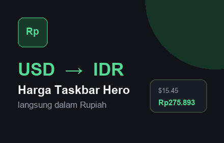
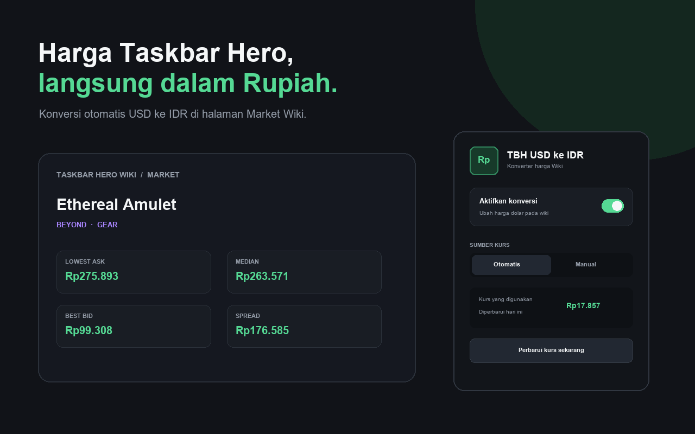

# TBH USD ke IDR

Ekstensi Google Chrome (Manifest V3) untuk mengonversi harga dalam mata uang USD menjadi Rupiah (IDR) pada situs **taskbarhero.wiki**.

Ekstensi ini hanya mengubah tampilan harga di browser dan **tidak mengubah data situs, Steam Market, maupun transaksi apa pun**.

---

## Fitur

- Mengonversi harga USD menjadi Rupiah (IDR).
- Mendukung pembaruan harga yang dimuat secara dinamis.
- Kurs dapat diperbarui secara otomatis.
- Mendukung pengaturan kurs secara manual.
- Konversi dapat diaktifkan atau dinonaktifkan melalui popup ekstensi.

---

## Instalasi

1. Buka halaman `chrome://extensions`.
2. Aktifkan **Mode Pengembang (Developer Mode)**.
3. Klik **Muat yang Belum Dipaketkan (Load Unpacked)**.
4. Pilih folder proyek ini.
5. Buka atau muat ulang halaman `https://taskbarhero.wiki/market`.

---

## Pengaturan Kurs

- Mode otomatis mengambil kurs USD ke IDR dari layanan penyedia kurs.
- Kurs diperbarui secara berkala.
- Jika layanan kurs tidak dapat diakses, ekstensi akan menggunakan kurs terakhir yang tersimpan.
- Pengguna juga dapat mengatur nilai kurs secara manual.

---

## Disclaimer

Proyek ini merupakan proyek independen dan **tidak berafiliasi, tidak didukung, serta tidak dikelola oleh Task Bar Hero maupun taskbarhero.wiki**.

Ekstensi ini hanya mengubah tampilan harga di browser pengguna untuk mempermudah melihat nilai dalam Rupiah.

Perbedaan nilai konversi dapat terjadi karena perubahan kurs mata uang.

---

## Open Source

Proyek ini bersifat **Open Source**.

Seluruh kode sumber dapat dipelajari, dimodifikasi, maupun dikembangkan lebih lanjut sesuai ketentuan lisensi yang digunakan.

Kontribusi berupa pelaporan bug, usulan fitur, maupun pull request sangat diterima.

---

## Pengembangan

Proyek ini dikembangkan dengan bantuan AI sebagai asisten pengembangan.

AI digunakan untuk membantu proses perancangan, penulisan kode, debugging, refactoring, dan dokumentasi.

Seluruh pengujian, validasi, serta keputusan akhir tetap dilakukan oleh pengembang.

---

## Lisensi

MIT License

